  

    
  

  
  
  
&nbsp;

  

  MY
   
  VISITOR
  

# Hi there 👋, I'm Yuhui Fu 

- 🔭 I'm currently studying for a master's degree in the School of Computer Science, Peking University
- 🧑‍🎓 I have obtained B.E. from the Dept. EE, Tsinghua University.
- 🤔 I love **Reading, Running**
- 📫 How to reach me: **fooyuhuii@gmail.com**
- ⚡ Fun fact: **LOL, Valorant, Movies**

## About My Github

<table>
  <tr>
    <td></td>
    <td></td>
  </tr>
</table>

